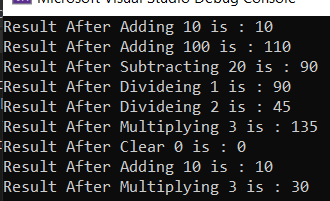

# 🧮 Calculator Console App

A simple Calculator console application developed with C#, demonstrating the fundamentals of Object-Oriented Programming (OOP).
The project supports basic arithmetic operations, result tracking, reset functionality, and safe division by zero handling.

---

# ✨ Features / الميزات

- ➕ Addition operation.
- ➖ Subtraction operation.
- ✖️ Multiplication operation.
- ➗ Division operation.
- 🛡️ Prevents division by zero.
- 🔄 Clear function to reset the calculator.
- 📋 Displays the result after every operation.
- 🧱 Clean Object-Oriented Programming (OOP) implementation.

---

# 📸 Preview / معاينة التطبيق

---

# 🚀 How to run the project / طريقة تشغيل المشروع

### English

1. Clone this repository or download the source code.
2. Open the solution using Visual Studio.
3. Run the project by pressing F5 or Ctrl + F5.

### العربية

1. قم بتحميل المشروع أو عمل Clone له.
2. افتح المشروع باستخدام Visual Studio.
3. اضغط F5 أو Ctrl + F5 لتشغيل البرنامج.

---

# 🛠️ Technologies Used / التقنيات المستخدمة

- C#
- .NET
- Console Application
- Object-Oriented Programming (OOP)

---

# 📂 Project Structure / هيكل المشروع

- clsCalculator
  - Add()
  - Subtract()
  - Multiply()
  - Divide()
  - Clear()
  - PrintResult()
- Program
  - Main()

---

# 👨‍💻 Author

YahyaNa-Dev
